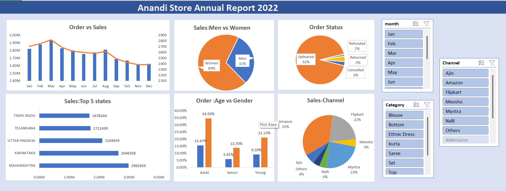
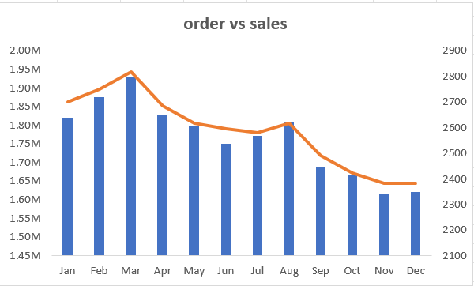
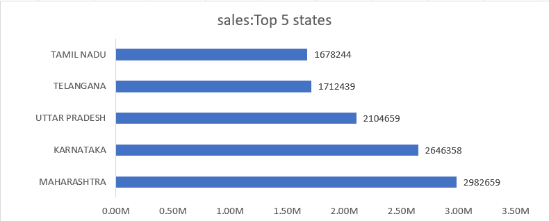
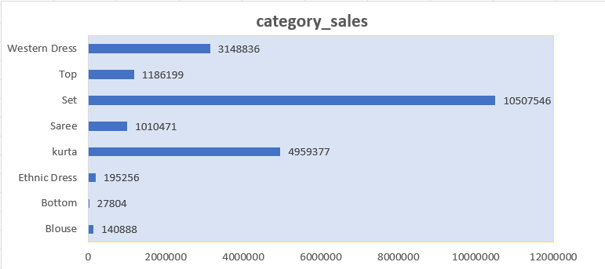

# Anandi Store Sales Analysis — 2022

## 📊 Project Overview

This project analyzes Anandi Store's 2022 sales data using Microsoft Excel.

The objective is to understand sales performance, customer demographics, product categories, sales channels, geographic performance, monthly trends, and order status.

An interactive Excel dashboard was created using PivotTables, PivotCharts, and slicers.

---

## 🎯 Business Objectives

- Analyze overall sales performance
- Identify monthly sales trends
- Compare sales by gender and age group
- Identify top-performing product categories
- Analyze sales channel performance
- Identify top-performing states
- Analyze order status
- Create an interactive sales dashboard
- Generate business insights and recommendations

---

## 📁 Dataset

The dataset contains retail sales information for 2022.

Important fields include:

- Order ID
- Customer ID
- Gender
- Age
- Age Group
- Date
- Status
- Channel
- SKU
- Category
- Size
- Quantity
- Amount
- Shipping State
- B2B

---

## 🛠️ Tools Used

- Microsoft Excel
- PivotTables
- PivotCharts
- Slicers
- Data Cleaning
- Data Aggregation
- Data Visualization
- Business Analysis

---

## 🔎 Business Questions

### Sales Performance

1. What is the total sales amount?
2. Which month has the highest sales?
3. Which month has the lowest sales?
4. How do sales change month over month?

### Customer Analysis

5. Which gender contributes more to sales?
6. Which age group contributes the most sales?
7. Which age group has the highest order volume?

### Product Analysis

8. Which category generates the highest sales?
9. Which category has the highest quantity sold?
10. Which products contribute most to sales?

### Sales Channel Analysis

11. Which sales channel generates the highest sales?
12. Which channel has the highest order volume?
13. How do Amazon, Myntra and Flipkart compare?

### Geographic Analysis

14. Which states generate the highest sales?
15. What are the top 5 states by sales?

### Order Status

16. What percentage of records are delivered?
17. How many records are returned?
18. How many are cancelled?
19. How many are refunded?

---

## 📈 Dashboard

The Excel dashboard provides:

- Monthly Sales and Order Trend
- Men vs Women Sales
- Order Status Distribution
- Top 5 States by Sales
- Age Group vs Gender Analysis
- Sales Channel Distribution
- Month Slicer
- Category Slicer
- Channel Slicer

### Dashboard Preview



---
## Detailed Analysis

### Monthly Sales Analysis


### Top 5 States by Sales


### Sales Channel Analysis


### Category Sales Analysis



---
## 💡 Key Insights

The detailed findings from the analysis are documented in:

[Business Questions and Insights](analysis/Business_Questions_and_Insights.md)

---

## 📌 Business Recommendations

Recommendations will be based on the validated findings from the sales analysis.

Key areas for further investigation include:

- High-performing product categories
- Sales channel performance
- Monthly sales fluctuations
- Regional sales performance
- Customer segment performance
- Returned and cancelled orders

---

## ⚠️ Data Limitations

- Multiple records may belong to the same Order ID.
- Record counts should not automatically be interpreted as unique orders.
- State names may require standardization.
- Sales amount does not represent profit because cost information is not available.
- The dataset covers one year, so year-over-year growth cannot be calculated.

---

## 🚀 Future Analysis

Future improvements could include:

- Customer retention analysis
- Repeat customer analysis
- Product-level analysis
- Return-rate analysis
- Monthly growth analysis
- Pareto analysis
- SQL analysis
- Python/Pandas analysis
- Power BI dashboard

---

## 📂 Project Structure

```text
Anandi_store_sales_analysis/
│
├── README.md
│
├── data/
│   └── Anandi_Store_Data_Analysis.xlsx
│
├── dashboard/
│   └── dashboard.png
│
└── analysis/
    └── Business_Questions_and_Insights.md
